# FluentCart Database Schema

FluentCart Core Advanced 

FluentCart uses custom database tables to store all the e-commerce data. Here are the list of database tables and their schema to understand overall database design and related data attributes of each model.

## Schema Design

FluentCart uses a comprehensive database schema designed for e-commerce operations. The schema is organized around core entities: Orders, Customers, Products, Subscriptions, and supporting tables for payments, shipping, and licensing.

### Core Entity Relationships

```mermaid
erDiagram
    fct_customers ||--o{ fct_orders : "places"
    fct_customers ||--o{ fct_customer_addresses : "has"
    fct_customers ||--o{ fct_subscriptions : "subscribes"
    fct_customers ||--o{ fct_carts : "owns"
    fct_customers ||--o{ fct_licenses : "owns"
    
    fct_orders ||--o{ fct_order_items : "contains"
    fct_orders ||--o{ fct_order_transactions : "has"
    fct_orders ||--o{ fct_subscriptions : "creates"
    fct_orders ||--o{ fct_applied_coupons : "uses"
    fct_orders ||--o{ fct_licenses : "generates"
    fct_orders ||--o{ fct_carts : "completes"
    fct_orders ||--o{ fct_orders : "parent/child"
    fct_orders ||--o{ fct_order_promotions : "has"
    fct_orders ||--o{ fct_activity : "logs"
    fct_orders ||--o{ fct_order_meta : "has_meta"
    fct_orders ||--o{ fct_order_tax_rate : "has_tax"
    
    fct_coupons ||--o{ fct_applied_coupons : "applied_to"
    
    fct_licenses ||--o{ fct_license_activations : "activated_on"
    fct_licenses ||--o{ fct_license_sites : "manages"
    fct_licenses ||--o{ fct_license_meta : "has_meta"
    fct_licenses ||--o{ fct_licenses : "parent/child"
    
    fct_license_sites ||--o{ fct_license_activations : "hosts"
    
    fct_product_details ||--o{ fct_product_variations : "has"
    fct_product_details ||--o{ fct_order_items : "ordered_as"
    fct_product_variations ||--o{ fct_order_items : "ordered_as"
    
    fct_atts_groups ||--o{ fct_atts_terms : "contains"
    fct_atts_groups ||--o{ fct_atts_relations : "relates"
    fct_atts_terms ||--o{ fct_atts_relations : "relates"
    
    fct_label ||--o{ fct_label_relationships : "tags"
    
    fct_scheduled_actions ||--o{ fct_activity : "logs"
    
    fct_shipping_zones ||--o{ fct_shipping_methods : "has"
    
    fct_order_promotions ||--o{ fct_order_promotion_stats : "tracks"
    fct_order_promotions ||--o{ fct_orders : "applies_to"
```

### Schema Overview

The FluentCart database schema is built around these core concepts:

- **Orders & Transactions**: Complete order lifecycle management with payment tracking
- **Customers & Addresses**: Customer relationship management with multiple address support  
- **Products & Variations**: Flexible product catalog with inventory management
- **Subscriptions**: Recurring billing and subscription lifecycle management
- **Coupons & Discounts**: Advanced discount system with conditions and stacking
- **Shipping & Tax**: Configurable shipping zones and tax rate management
- **Activity & Logging**: Comprehensive audit trail for all operations
- **Email Notifications**: Automated email templates and delivery system
- **Background Jobs**: Scheduled actions for automated processing
- **Cart Management**: Shopping cart persistence and checkout flow
- **Attributes & Labels**: Flexible product attributes and object tagging system
- **Webhooks**: External integration logging and delivery tracking
- **Licensing** (Pro): Software license management with activation tracking
- **Promotions** (Pro): Order promotion tracking and statistics

### Key Design Principles

1. **Currency Precision**: All monetary values stored as BIGINT in cents to avoid floating-point precision issues
2. **Flexible Configuration**: JSON columns used for extensible configuration data
3. **Audit Trail**: Comprehensive activity logging for all important operations
4. **Referential Integrity**: Proper foreign key relationships maintained throughout
5. **Performance Optimization**: Strategic indexing on frequently queried columns
6. **Multi-tenancy Ready**: UUID-based public identifiers for external integrations 

## Database Tables

## \_fct\_orders Table

This table stores the basic information of an order

| Column | Type | Comment |
|--------|------|---------|
| idx | bigint unsigned _Auto Increment_ | |
| statusx | varchar(20) | draft, pending, on-hold, processing, completed, failed, refunded, partial-refund |
| parent_idx | bigint unsigned _NULL_ | |
| receipt_number | bigint unsigned _NULL_ | |
| invoice_no | varchar(192) _NULL_ | |
| fulfillment_type | varchar(20) _NULL_ | physical, digital, service, mixed |
| type | varchar(20) | payment, renewal, refund |
| mode | enum | live, test |
| shipping_status | varchar(20) | unshipped, shipped, delivered, unshippable |
| customer_id | bigint unsigned _NULL_ | |
| payment_method | varchar(100) | |
| payment_status | varchar(20) | |
| payment_method_title | varchar(100) | |
| currency | varchar(10) | |
| subtotal | bigint | Amount in cents |
| discount_tax | bigint | Amount in cents |
| manual_discount_total | bigint | Amount in cents |
| coupon_discount_total | bigint | Amount in cents |
| shipping_tax | bigint | Amount in cents |
| shipping_total | bigint | Amount in cents |
| tax_total | bigint | Amount in cents |
| total_amount | bigint | Amount in cents |
| total_paid | bigint | Amount in cents |
| total_refund | bigint | Amount in cents |
| rate | decimal(12,4) | Exchange rate |
| note | text _NULL_ | |
| ip_address | text _NULL_ | |
| completed_at | datetime _NULL_ | |
| refunded_at | datetime _NULL_ | |
| uuid | varchar(100) | |
| config | json _NULL_ | |
| created_at | datetime _NULL_ | |
| updated_at | datetime _NULL_ | |

## fct\_customers Table

This table stores the basic information of a customer

| Column | Type | Comment |
|--------|------|---------|
| id | bigint unsigned _Auto Increment_ | |
| user_id | bigint unsigned _NULL_ | |
| contact_id | bigint unsigned | |
| email | varchar(192) | |
| first_name | varchar(192) | |
| last_name | varchar(192) | |
| status | varchar(45) _NULL_ | active, archived |
| purchase_value | json _NULL_ | |
| purchase_count | bigint unsigned | |
| ltv | bigint | Lifetime value in cents |
| first_purchase_date | datetime _NULL_ | |
| last_purchase_date | datetime _NULL_ | |
| aov | decimal(18,2) _NULL_ | Average order value |
| notes | longtext | |
| uuid | varchar(100) _NULL_ | |
| country | varchar(45) _NULL_ | |
| city | varchar(45) _NULL_ | |
| state | varchar(45) _NULL_ | |
| postcode | varchar(45) _NULL_ | |
| created_at | datetime _NULL_ | |
| updated_at | datetime _NULL_ | |

## fct\_order\_items Table

This table stores individual items within orders

| Column | Type | Comment |
|--------|------|---------|
| id | bigint unsigned _Auto Increment_ | |
| order_id | bigint unsigned | |
| post_id | bigint unsigned | WordPress post ID (product) |
| fulfillment_type | varchar(20) | physical, digital, service |
| payment_type | varchar(20) | onetime, subscription, signup_fee |
| post_title | text | Product title |
| title | text | Item title (variation) |
| object_id | bigint unsigned _NULL_ | Variation ID |
| cart_index | bigint unsigned | Position in cart |
| quantity | int | Item quantity |
| unit_price | bigint | Price per unit in cents |
| cost | bigint | Cost in cents |
| subtotal | bigint | Line subtotal |
| tax_amount | bigint | Tax amount for this line |
| shipping_charge | bigint | Shipping charge |
| discount_total | bigint | Discount amount |
| line_total | bigint | Total line amount |
| refund_total | bigint | Refunded amount |
| rate | bigint | Exchange rate |
| other_info | json _NULL_ | Additional item data |
| line_meta | json _NULL_ | Line-specific metadata |
| fulfilled_quantity | int | Quantity fulfilled |
| referrer | text _NULL_ | Referral information |
| created_at | datetime _NULL_ | |
| updated_at | datetime _NULL_ | |

## fct\_order\_transactions Table

This table stores payment transactions for orders

| Column | Type | Comment |
|--------|------|---------|
| id | bigint unsigned _Auto Increment_ | |
| order_id | bigint unsigned | |
| order_type | varchar(100) | |
| transaction_type | varchar(192) | charge, refund, etc. |
| subscription_id | int _NULL_ | Reference to subscription |
| card_last_4 | int(4) _NULL_ | Last 4 digits of card |
| card_brand | varchar(100) _NULL_ | Card brand |
| vendor_charge_id | varchar(192) | Payment gateway transaction ID |
| payment_method | varchar(100) | |
| payment_mode | varchar(100) | live, test |
| payment_method_type | varchar(100) | card, bank, etc. |
| status | varchar(20) | Transaction status |
| currency | varchar(10) | Transaction currency |
| total | bigint | Transaction amount in cents |
| rate | bigint | Exchange rate |
| uuid | varchar(100) _NULL_ | |
| meta | json _NULL_ | Transaction metadata |
| created_at | datetime _NULL_ | |
| updated_at | datetime _NULL_ | |

## fct\_order\_addresses Table

This table stores order shipping and billing addresses

| Column | Type | Comment |
|--------|------|---------|
| id | bigint unsigned _Auto Increment_ | |
| order_id | bigint unsigned | Reference to order |
| type | varchar(20) | billing, shipping |
| name | varchar(192) _NULL_ | Address name |
| address_1 | varchar(192) _NULL_ | Address line 1 |
| address_2 | varchar(192) _NULL_ | Address line 2 |
| city | varchar(192) _NULL_ | City |
| state | varchar(192) _NULL_ | State |
| postcode | varchar(50) _NULL_ | Postal code |
| country | varchar(100) _NULL_ | Country |
| created_at | datetime _NULL_ | |
| updated_at | datetime _NULL_ | |

## fct\_order\_operations Table

This table stores order operation logs and analytics

| Column | Type | Comment |
|--------|------|---------|
| id | bigint unsigned _Auto Increment_ | |
| order_id | bigint unsigned | Reference to order |
| created_via | varchar(45) _NULL_ | How the order was created |
| emails_sent | tinyint(1) _NULL_ | Emails sent flag |
| sales_recorded | tinyint(1) _NULL_ | Sales recorded flag |
| utm_campaign | varchar(192) _NULL_ | UTM campaign tracking |
| utm_term | varchar(192) _NULL_ | UTM term tracking |
| utm_source | varchar(192) _NULL_ | UTM source tracking |
| utm_medium | varchar(192) _NULL_ | UTM medium tracking |
| utm_content | varchar(192) _NULL_ | UTM content tracking |
| utm_id | varchar(192) _NULL_ | UTM ID tracking |
| cart_hash | varchar(192) _NULL_ | Cart hash identifier |
| refer_url | varchar(192) _NULL_ | Referral URL |
| meta | json _NULL_ | Additional operation metadata |
| created_at | datetime _NULL_ | |
| updated_at | datetime _NULL_ | |

## fct\_order\_download\_permissions Table

This table stores download permissions for orders

| Column | Type | Comment |
|--------|------|---------|
| id | bigint unsigned _Auto Increment_ | |
| order_id | bigint unsigned | Reference to order |
| variation_id | bigint unsigned | Reference to product variation |
| download_id | bigint unsigned | Reference to download |
| download_count | int _NULL_ | Number of downloads |
| download_limit | int _NULL_ | Download limit |
| access_expires | datetime _NULL_ | Access expiration date |
| customer_id | bigint unsigned | Reference to customer |
| created_at | datetime _NULL_ | |
| updated_at | datetime _NULL_ | |

## fct\_order\_details\_meta Table

This table stores order details metadata

| Column | Type | Comment |
|--------|------|---------|
| id | bigint unsigned _Auto Increment_ | |
| object_id | bigint unsigned _NULL_ | Related object ID |
| object_type | varchar(100) _NULL_ | Object type |
| meta_key | varchar(192) _NULL_ | Meta key |
| meta_value | longtext _NULL_ | Meta value |
| created_at | datetime _NULL_ | |
| updated_at | datetime _NULL_ | |

## fct\_subscriptions Table

This table stores subscription information

| Column | Type | Comment |
|--------|------|---------|
| id | bigint unsigned _Auto Increment_ | |
| uuid | varchar(100) | |
| customer_id | bigint unsigned | |
| parent_order_id | bigint unsigned | |
| product_id | bigint unsigned | WordPress post ID |
| item_name | text | Item name |
| quantity | int | Subscription quantity |
| variation_id | bigint unsigned | Variation ID |
| billing_interval | varchar(45) _NULL_ | Billing interval |
| signup_fee | bigint unsigned | Signup fee in cents |
| initial_tax_total | bigint unsigned | Initial tax total |
| recurring_amount | bigint unsigned | Recurring amount |
| recurring_tax_total | bigint unsigned | Recurring tax total |
| recurring_total | bigint unsigned | Total recurring amount |
| bill_times | bigint unsigned | Number of billing cycles |
| bill_count | int unsigned | Current bill count |
| expire_at | datetime _NULL_ | Expiration date |
| trial_ends_at | datetime _NULL_ | Trial end date |
| canceled_at | datetime _NULL_ | Cancellation date |
| restored_at | datetime _NULL_ | Restoration date |
| collection_method | enum | automatic, manual, system |
| next_billing_date | datetime _NULL_ | Next billing date |
| trial_days | int unsigned | Trial period in days |
| vendor_customer_id | varchar(45) _NULL_ | Payment gateway customer ID |
| vendor_plan_id | varchar(45) _NULL_ | Payment gateway plan ID |
| vendor_subscription_id | varchar(45) _NULL_ | Payment gateway subscription ID |
| status | varchar(45) _NULL_ | Subscription status |
| original_plan | longtext _NULL_ | Original plan data |
| vendor_response | longtext _NULL_ | Payment gateway response |
| current_payment_method | varchar(45) _NULL_ | Current payment method |
| config | json _NULL_ | Subscription configuration |
| created_at | datetime _NULL_ | |
| updated_at | datetime _NULL_ | |

## fct\_product\_details Table

This table stores product configuration and details

| Column | Type | Comment |
|--------|------|---------|
| id | bigint unsigned _Auto Increment_ | |
| post_id | bigint unsigned | WordPress post ID |
| fulfillment_type | varchar(100) _NULL_ | physical, digital, service, mixed |
| min_price | double | Minimum price |
| max_price | double | Maximum price |
| default_variation_id | bigint unsigned _NULL_ | Default variation ID |
| default_media | json _NULL_ | Default media configuration |
| manage_stock | tinyint(1) _NULL_ | Stock management enabled |
| stock_availability | varchar(100) _NULL_ | in-stock, out-of-stock, backorder |
| variation_type | varchar(30) _NULL_ | simple, simple_variation, advance_variation |
| manage_downloadable | tinyint(1) _NULL_ | Download management enabled |
| other_info | json _NULL_ | Additional product information |
| created_at | datetime _NULL_ | |
| updated_at | datetime _NULL_ | |

## fct\_product\_variations Table

This table stores product variations with pricing and inventory

| Column | Type | Comment |
|--------|------|---------|
| id | bigint unsigned _Auto Increment_ | |
| post_id | bigint unsigned | WordPress post ID |
| media_id | bigint unsigned _NULL_ | Media attachment ID |
| serial_index | int(5) _NULL_ | Variation order |
| sold_individually | tinyint(1) unsigned _NULL_ | Sold individually flag |
| variation_title | varchar(192) | Variation title |
| variation_identifier | varchar(100) _NULL_ | SKU or identifier |
| manage_stock | tinyint(1) _NULL_ | Stock management enabled |
| payment_type | varchar(50) _NULL_ | onetime, subscription |
| stock_status | varchar(30) _NULL_ | in-stock, out-of-stock, backorder |
| backorders | tinyint(1) unsigned _NULL_ | Backorders allowed |
| total_stock | int(11) _NULL_ | Total stock quantity |
| on_hold | int(11) _NULL_ | Stock on hold |
| committed | int(11) _NULL_ | Committed stock |
| available | int(11) _NULL_ | Available stock |
| fulfillment_type | varchar(100) _NULL_ | physical, digital, service |
| item_status | varchar(30) _NULL_ | active, inactive |
| manage_cost | varchar(30) _NULL_ | Cost management enabled |
| item_price | double | Variation price |
| item_cost | double | Variation cost |
| compare_price | double _NULL_ | Compare at price |
| shipping_class | bigint(20) _NULL_ | Shipping class ID |
| other_info | longtext _NULL_ | Additional variation data |
| downloadable | varchar(30) _NULL_ | Downloadable flag |
| created_at | datetime _NULL_ | |
| updated_at | datetime _NULL_ | |

## fct\_coupons Table

This table stores coupon definitions and rules

| Column | Type | Comment |
|--------|------|---------|
| id | bigint unsigned _Auto Increment_ | |
| title | varchar(200) | Coupon title |
| code | varchar(50) | Coupon code (unique) |
| priority | int _NULL_ | Coupon priority |
| type | varchar(20) | Coupon type |
| conditions | json _NULL_ | Coupon conditions |
| amount | double | Discount amount |
| use_count | int _NULL_ | Usage count |
| status | varchar(20) | Coupon status |
| notes | longtext | Coupon notes |
| stackable | varchar(3) | Stackable flag (yes/no) |
| show_on_checkout | varchar(3) | Show on checkout (yes/no) |
| start_date | timestamp _NULL_ | Start date |
| end_date | timestamp _NULL_ | End date |
| created_at | datetime _NULL_ | |
| updated_at | datetime _NULL_ | |

## fct\_applied\_coupons Table

This table stores applied coupons to orders

| Column | Type | Comment |
|--------|------|---------|
| id | bigint unsigned _Auto Increment_ | |
| order_id | bigint unsigned | Reference to order |
| coupon_id | bigint unsigned _NULL_ | Reference to coupon |
| customer_id | bigint unsigned _NULL_ | Reference to customer |
| code | varchar(100) | Coupon code |
| amount | double | Discount amount |
| created_at | datetime _NULL_ | |
| updated_at | datetime _NULL_ | |

## fct\_customer\_addresses Table

This table stores customer shipping and billing addresses

| Column | Type | Comment |
|--------|------|---------|
| id | bigint unsigned _Auto Increment_ | |
| customer_id | bigint unsigned | Reference to customer |
| is_primary | tinyint(1) | Primary address flag |
| type | varchar(20) | billing, shipping |
| status | varchar(20) | active, inactive |
| label | varchar(50) | Address label |
| name | varchar(192) _NULL_ | Address name |
| address_1 | varchar(192) _NULL_ | Address line 1 |
| address_2 | varchar(192) _NULL_ | Address line 2 |
| city | varchar(192) _NULL_ | City |
| state | varchar(192) _NULL_ | State |
| phone | varchar(192) _NULL_ | Phone number |
| email | varchar(192) _NULL_ | Email address |
| postcode | varchar(32) _NULL_ | Postal code |
| country | varchar(100) _NULL_ | Country |
| created_at | datetime _NULL_ | |
| updated_at | datetime _NULL_ | |

## fct\_customer\_meta Table

This table stores customer metadata

| Column | Type | Comment |
|--------|------|---------|
| id | bigint unsigned _Auto Increment_ | |
| customer_id | bigint unsigned _NULL_ | Reference to customer |
| meta_key | varchar(192) _NULL_ | Meta key |
| meta_value | longtext _NULL_ | Meta value |
| created_at | datetime _NULL_ | |
| updated_at | datetime _NULL_ | |

## fct\_carts Table

This table stores shopping cart data

| Column | Type | Comment |
|--------|------|---------|
| customer_id | bigint unsigned _NULL_ | Reference to customer |
| user_id | bigint unsigned _NULL_ | Reference to WordPress user |
| order_id | bigint unsigned _NULL_ | Reference to order |
| cart_hash | varchar(192) | Unique cart identifier |
| checkout_data | longtext _NULL_ | Checkout form data |
| cart_data | longtext _NULL_ | Cart contents |
| utm_data | longtext _NULL_ | UTM tracking data |
| coupons | longtext _NULL_ | Applied coupons |
| first_name | varchar(192) _NULL_ | Customer first name |
| last_name | varchar(192) _NULL_ | Customer last name |
| email | varchar(192) _NULL_ | Customer email |
| stage | varchar(30) _NULL_ | draft, pending, in-complete, completed |
| cart_group | varchar(30) _NULL_ | Cart group |
| user_agent | varchar(192) _NULL_ | User agent string |
| ip_address | varchar(50) _NULL_ | IP address |
| completed_at | timestamp _NULL_ | Completion timestamp |
| created_at | datetime _NULL_ | |
| updated_at | datetime _NULL_ | |
| deleted_at | timestamp _NULL_ | Soft delete timestamp |

## fct\_product\_meta Table

This table stores product metadata

| Column | Type | Comment |
|--------|------|---------|
| id | bigint unsigned _Auto Increment_ | |
| object_id | bigint unsigned | Reference to product |
| object_type | varchar(192) _NULL_ | Object type |
| meta_key | varchar(192) | Meta key |
| meta_value | longtext _NULL_ | Meta value |
| created_at | datetime _NULL_ | |
| updated_at | datetime _NULL_ | |

## fct\_product\_downloads Table

This table stores downloadable product files

| Column | Type | Comment |
|--------|------|---------|
| id | bigint unsigned _Auto Increment_ | |
| post_id | bigint unsigned | WordPress post ID |
| product_variation_id | longtext | Product variation ID |
| download_identifier | varchar(100) | Unique download identifier |
| title | varchar(192) _NULL_ | Download title |
| type | varchar(100) _NULL_ | Download type |
| driver | varchar(100) _NULL_ | Storage driver |
| file_name | varchar(192) _NULL_ | File name |
| file_path | text _NULL_ | File path |
| file_url | text _NULL_ | File URL |
| file_size | text _NULL_ | File size |
| settings | text _NULL_ | Download settings |
| serial | int _NULL_ | Serial number |
| created_at | datetime _NULL_ | |
| updated_at | datetime _NULL_ | |

## fct\_subscription\_meta Table

This table stores subscription metadata

| Column | Type | Comment |
|--------|------|---------|
| id | bigint unsigned _Auto Increment_ | |
| subscription_id | bigint unsigned _NULL_ | Reference to subscription |
| meta_key | varchar(192) _NULL_ | Meta key |
| meta_value | longtext _NULL_ | Meta value |
| created_at | datetime _NULL_ | |
| updated_at | datetime _NULL_ | |

## fct\_activity Table

This table stores system activity and audit logs

| Column | Type | Comment |
|--------|------|---------|
| id | bigint unsigned _Auto Increment_ | |
| status | varchar(20) | success, warning, failed, info |
| log_type | varchar(20) | activity, api |
| module_type | varchar(100) | Full model path |
| module_id | bigint _NULL_ | Related record ID |
| module_name | varchar(192) | order, product, user, coupon, subscription, payment, refund, shipment, activity |
| user_id | bigint unsigned _NULL_ | User who performed action |
| title | varchar(192) _NULL_ | Activity title |
| content | longtext _NULL_ | Activity description |
| read_status | varchar(20) | read, unread |
| created_by | varchar(100) | Creator identifier |
| created_at | datetime _NULL_ | |
| updated_at | datetime _NULL_ | |

## fct\_licenses Table (Pro Plugin)

This table stores software license management

| Column | Type | Comment |
|--------|------|---------|
| id | bigint unsigned _Auto Increment_ | |
| status | varchar(45) _NULL_ | active, inactive, expired |
| limit | bigint unsigned | Activation limit |
| activation_count | bigint unsigned | Current activations |
| license_key | varchar(192) _NULL_ | License key |
| product_id | bigint unsigned | WordPress post ID |
| variation_id | bigint unsigned | Variation ID |
| order_id | bigint unsigned | Reference to fct_orders |
| parent_id | bigint unsigned _NULL_ | Parent license ID |
| customer_id | bigint unsigned | Reference to fct_customers |
| expiration_date | datetime _NULL_ | License expiration |
| last_reminder_sent | datetime _NULL_ | Last reminder date |
| last_reminder_type | varchar(50) _NULL_ | Reminder type |
| subscription_id | bigint unsigned | Associated subscription |
| config | json _NULL_ | License configuration |
| created_at | timestamp _NULL_ | |
| updated_at | timestamp _NULL_ | |

## fct\_license\_activations Table (Pro Plugin)

This table stores license activation tracking

| Column | Type | Comment |
|--------|------|---------|
| id | bigint unsigned _Auto Increment_ | |
| site_id | bigint unsigned | Reference to fct_license_sites |
| license_id | bigint unsigned | Reference to fct_licenses |
| status | varchar(45) _NULL_ | active, inactive |
| is_local | tinyint _NULL_ | Local activation flag |
| product_id | bigint unsigned | WordPress post ID |
| variation_id | bigint unsigned | Variation ID |
| activation_method | varchar(45) _NULL_ | key_based, etc. |
| activation_hash | varchar(99) _NULL_ | Activation hash |
| last_update_version | varchar(45) _NULL_ | Last update version |
| last_update_date | datetime _NULL_ | Last update date |
| created_at | timestamp _NULL_ | |
| updated_at | timestamp _NULL_ | |

## fct\_license\_sites Table (Pro Plugin)

This table stores license site management

| Column | Type | Comment |
|--------|------|---------|
| id | bigint unsigned _Auto Increment_ | |
| license_id | bigint unsigned | Reference to fct_licenses |
| site_url | varchar(255) | Site URL |
| site_name | varchar(255) _NULL_ | Site name |
| status | varchar(45) _NULL_ | active, inactive |
| created_at | timestamp _NULL_ | |
| updated_at | timestamp _NULL_ | |

## fct\_shipping\_zones Table

This table stores shipping zones configuration

| Column | Type | Comment |
|--------|------|---------|
| id | bigint unsigned _Auto Increment_ | |
| name | varchar(192) | Zone name |
| regions | longtext _NULL_ | Zone regions (JSON) |
| order | int unsigned | Display order |
| created_at | datetime _NULL_ | |
| updated_at | datetime _NULL_ | |

## fct\_shipping\_methods Table

This table stores shipping methods within zones

| Column | Type | Comment |
|--------|------|---------|
| id | bigint unsigned _Auto Increment_ | |
| zone_id | bigint unsigned | Reference to shipping zone |
| title | varchar(192) | Method title |
| type | varchar(50) | Method type |
| settings | longtext _NULL_ | Method settings |
| is_enabled | tinyint(1) | Enabled flag |
| amount | bigint unsigned _NULL_ | Shipping amount |
| order | int unsigned | Display order |
| created_at | datetime _NULL_ | |
| updated_at | datetime _NULL_ | |

## fct\_shipping\_classes Table

This table stores shipping classes

| Column | Type | Comment |
|--------|------|---------|
| id | bigint unsigned _Auto Increment_ | |
| name | varchar(192) | Class name |
| cost | decimal(10,2) | Shipping cost |
| per_item | tinyint(1) | Per item flag |
| type | varchar(20) | Class type |
| created_at | datetime _NULL_ | |
| updated_at | datetime _NULL_ | |

## fct\_tax\_classes Table

This table stores tax classes

| Column | Type | Comment |
|--------|------|---------|
| id | bigint unsigned _Auto Increment_ | |
| title | varchar(192) _NULL_ | Class title |
| slug | varchar(100) _NULL_ | Class slug |
| description | longtext _NULL_ | Class description |
| meta | json _NULL_ | Class metadata |
| created_at | datetime _NULL_ | |
| updated_at | datetime _NULL_ | |

## fct\_tax\_rates Table

This table stores tax rate configurations

| Column | Type | Comment |
|--------|------|---------|
| id | bigint unsigned _Auto Increment_ | |
| class_id | bigint unsigned | Tax class ID |
| country | varchar(45) _NULL_ | Country code |
| state | varchar(45) _NULL_ | State code |
| postcode | text _NULL_ | Postal code (supports ranges) |
| city | varchar(45) _NULL_ | City |
| rate | varchar(45) _NULL_ | Tax rate |
| name | varchar(45) _NULL_ | Tax name |
| group | varchar(45) _NULL_ | Tax group |
| priority | int unsigned _NULL_ | Priority |
| is_compound | tinyint unsigned _NULL_ | Compound tax flag |
| for_shipping | tinyint unsigned _NULL_ | Apply to shipping |
| for_order | tinyint unsigned _NULL_ | Apply to order |

## fct\_meta Table

This table stores generic metadata for various objects

| Column | Type | Comment |
|--------|------|---------|
| id | bigint unsigned _Auto Increment_ | |
| object_type | varchar(50) | Object type |
| object_id | bigint _NULL_ | Object ID |
| meta_key | varchar(192) | Meta key |
| meta_value | longtext _NULL_ | Meta value |
| created_at | datetime _NULL_ | |
| updated_at | datetime _NULL_ | |

## fct\_email\_notifications Table

This table stores email notification templates and settings

| Column | Type | Comment |
|--------|------|---------|
| id | bigint unsigned _Auto Increment_ | |
| title | varchar(200) | Notification title |
| events | json _NULL_ | Trigger events |
| to | json _NULL_ | Recipient configuration |
| from | varchar(255) | Sender email |
| cc | varchar(255) _NULL_ | CC recipients |
| subject | varchar(255) | Email subject |
| enabled | varchar(3) | yes, no |
| content | text | Email content |
| path | varchar(200) | Template path |
| to_email | longtext | Email recipients |
| created_at | timestamp _NULL_ | |
| updated_at | timestamp _NULL_ | |

## fct\_label Table

This table stores labels for tagging objects

| Column | Type | Comment |
|--------|------|---------|
| id | bigint unsigned _Auto Increment_ | |
| value | varchar(192) | Label value (unique) |
| created_at | datetime _NULL_ | |
| updated_at | datetime _NULL_ | |

## fct\_order\_meta Table

This table stores order metadata

| Column | Type | Comment |
|--------|------|---------|
| id | bigint unsigned _Auto Increment_ | |
| order_id | bigint _NULL_ | Reference to order |
| key | varchar(192) | Meta key |
| value | longtext _NULL_ | Meta value |
| created_at | datetime _NULL_ | |
| updated_at | datetime _NULL_ | |

## fct\_order\_tax\_rate Table

This table stores order tax rate information

| Column | Type | Comment |
|--------|------|---------|
| id | bigint unsigned _Auto Increment_ | |
| order_id | bigint unsigned | Reference to order |
| tax_rate_id | bigint unsigned | Reference to tax rate |
| tax_amount | bigint | Tax amount in cents |
| created_at | datetime _NULL_ | |
| updated_at | datetime _NULL_ | |

## fct\_webhook\_logger Table

This table stores webhook delivery logs and status

| Column | Type | Comment |
|--------|------|---------|
| id | bigint unsigned _Auto Increment_ | |
| source | varchar(20) | Webhook source |
| event_type | varchar(100) | Event type |
| payload | longtext _NULL_ | Webhook payload |
| status | varchar(20) | pending, sent, failed |
| created_at | datetime _NULL_ | |
| updated_at | datetime _NULL_ | |

## fct\_scheduled\_actions Table

This table stores background job scheduling and execution

| Column | Type | Comment |
|--------|------|---------|
| id | bigint unsigned _Auto Increment_ | |
| scheduled_at | datetime _NULL_ | When to run the action |
| action | varchar(192) _NULL_ | Action to perform |
| status | varchar(20) _NULL_ | pending, processing, completed, failed |
| group | varchar(100) _NULL_ | order, subscription |
| object_id | bigint unsigned _NULL_ | Related object ID |
| object_type | varchar(100) _NULL_ | Object type |
| completed_at | timestamp _NULL_ | When action was completed |
| retry_count | int unsigned | Number of retries |
| data | json _NULL_ | Action data |
| created_at | datetime _NULL_ | |
| updated_at | datetime _NULL_ | |
| response_note | longtext _NULL_ | Response or error message |

## fct\_atts\_groups Table

This table stores attribute groups for product attributes

| Column | Type | Comment |
|--------|------|---------|
| id | bigint unsigned _Auto Increment_ | |
| title | varchar(192) | Group title |
| slug | varchar(192) | Group slug |
| description | longtext _NULL_ | Group description |
| settings | longtext _NULL_ | Group settings |
| created_at | datetime _NULL_ | |
| updated_at | datetime _NULL_ | |

## fct\_atts\_terms Table

This table stores attribute terms within groups

| Column | Type | Comment |
|--------|------|---------|
| id | bigint unsigned _Auto Increment_ | |
| group_id | bigint unsigned | Reference to attribute group |
| serial | int unsigned | Term order |
| title | varchar(192) | Term title |
| slug | varchar(192) | Term slug |
| description | longtext _NULL_ | Term description |
| settings | longtext _NULL_ | Term settings |
| created_at | datetime _NULL_ | |
| updated_at | datetime _NULL_ | |

## fct\_atts\_relations Table

This table stores relationships between attributes and objects

| Column | Type | Comment |
|--------|------|---------|
| id | bigint unsigned _Auto Increment_ | |
| group_id | bigint unsigned | Reference to attribute group |
| term_id | bigint unsigned | Reference to attribute term |
| object_id | bigint unsigned | Related object ID |
| created_at | datetime _NULL_ | |
| updated_at | datetime _NULL_ | |

## fct\_label\_relationships Table

This table stores polymorphic relationships between labels and objects

| Column | Type | Comment |
|--------|------|---------|
| id | bigint unsigned _Auto Increment_ | |
| label_id | bigint | Reference to label |
| labelable_id | bigint | Related object ID |
| labelable_type | varchar(192) | Object type |
| created_at | datetime _NULL_ | |
| updated_at | datetime _NULL_ | |

## fct\_scheduled\_actions Table

This table stores background job scheduling and execution

| Column | Type | Comment |
|--------|------|---------|
| id | bigint unsigned _Auto Increment_ | |
| scheduled_at | datetime _NULL_ | When to run the action |
| action | varchar(192) _NULL_ | Action to perform |
| status | varchar(20) _NULL_ | pending, processing, completed, failed |
| group | varchar(100) _NULL_ | order, subscription |
| object_id | bigint unsigned _NULL_ | Related object ID |
| object_type | varchar(100) _NULL_ | Object type |
| completed_at | timestamp _NULL_ | When action was completed |
| retry_count | int unsigned | Number of retries |
| data | json _NULL_ | Action data |
| created_at | datetime _NULL_ | |
| updated_at | datetime _NULL_ | |
| response_note | longtext _NULL_ | Response or error message |

## Pro Plugin Tables

### fct\_licenses Table

This table stores software licenses (Pro feature)

| Column | Type | Comment |
|--------|------|---------|
| id | bigint unsigned _Auto Increment_ | |
| status | varchar(45) | active, inactive, expired |
| limit | int _NULL_ | Activation limit |
| license_key | varchar(192) | License key |
| product_id | bigint unsigned _NULL_ | Related product |
| customer_id | bigint unsigned _NULL_ | License owner |
| order_id | bigint unsigned _NULL_ | Related order |
| expiration_date | datetime _NULL_ | License expiration |
| created_at | datetime _NULL_ | |
| updated_at | datetime _NULL_ | |

### fct\_license\_activations Table

This table stores license activation records (Pro feature)

| Column | Type | Comment |
|--------|------|---------|
| id | bigint unsigned _Auto Increment_ | |
| site_id | bigint unsigned | Reference to license site |
| license_id | bigint unsigned | Reference to license |
| status | varchar(45) | active, inactive |
| product_id | bigint unsigned _NULL_ | Related product |
| activation_hash | varchar(192) | Activation hash |
| created_at | datetime _NULL_ | |
| updated_at | datetime _NULL_ | |

### fct\_license\_sites Table

This table stores licensed sites (Pro feature)

| Column | Type | Comment |
|--------|------|---------|
| id | bigint unsigned _Auto Increment_ | |
| license_id | bigint unsigned | Reference to license |
| site_url | varchar(500) | Site URL |
| site_name | varchar(192) _NULL_ | Site name |
| status | varchar(45) | active, inactive |
| created_at | datetime _NULL_ | |
| updated_at | datetime _NULL_ | |

### fct\_license\_meta Table

This table stores license metadata (Pro feature)

| Column | Type | Comment |
|--------|------|---------|
| id | bigint unsigned _Auto Increment_ | |
| license_id | bigint unsigned | Reference to license |
| meta_key | varchar(192) | Meta key |
| meta_value | longtext _NULL_ | Meta value |
| created_at | datetime _NULL_ | |
| updated_at | datetime _NULL_ | |

### fct\_order\_promotions Table

This table stores order promotion data (Pro feature)

| Column | Type | Comment |
|--------|------|---------|
| id | bigint(20) unsigned _Auto Increment_ | |
| hash | varchar(100) | Unique promotion hash |
| parent_id | bigint(20) unsigned _NULL_ | Parent promotion ID |
| type | varchar(50) | Promotion type |
| status | varchar(50) | Promotion status (default: draft) |
| src_object_id | bigint(20) unsigned _NULL_ | Source object ID |
| src_object_type | varchar(50) _NULL_ | Source object type |
| title | varchar(194) _NULL_ | Promotion title |
| description | text _NULL_ | Promotion description |
| conditions | json _NULL_ | Promotion conditions |
| config | json _NULL_ | Promotion configuration |
| priority | int | Promotion priority (default: 1) |
| created_at | datetime _NULL_ | |
| updated_at | datetime _NULL_ | |

### fct\_order\_promotion\_stats Table

This table stores promotion statistics (Pro feature)

| Column | Type | Comment |
|--------|------|---------|
| id | bigint(20) unsigned _Auto Increment_ | |
| promotion_id | bigint(20) unsigned | Reference to promotion |
| order_id | bigint(20) unsigned | Reference to order |
| object_id | bigint(20) unsigned | Related object ID |
| amount | bigint | Amount in cents (default: 0) |
| status | varchar(50) | Stat status (default: offered) |
| created_at | datetime _NULL_ | |
| updated_at | datetime _NULL_ | |

---

