# FluentCart Database Schema

FluentCart Core Advanced 

FluentCart uses custom database tables to store all the e-commerce data. Here are the list of database tables and their schema to understand overall database design and related data attributes of each model.

## Schema Design

FluentCart uses a comprehensive database schema designed for e-commerce operations. The schema is organized around core entities: Orders, Customers, Products, Subscriptions, and supporting tables for payments, shipping, and licensing.

### Core Entity Relationships

```mermaid
erDiagram
    fct_customers ||--o{ fct_orders : "places"
    fct_customers ||--o{ fct_customer_addresses : "has"
    fct_customers ||--o{ fct_subscriptions : "subscribes"
    fct_customers ||--o{ fct_carts : "owns"
    fct_customers ||--o{ fct_licenses : "owns"
    
    fct_orders ||--o{ fct_order_items : "contains"
    fct_orders ||--o{ fct_order_transactions : "has"
    fct_orders ||--o{ fct_subscriptions : "creates"
    fct_orders ||--o{ fct_applied_coupons : "uses"
    fct_orders ||--o{ fct_licenses : "generates"
    fct_orders ||--o{ fct_carts : "completes"
    fct_orders ||--o{ fct_orders : "parent/child"
    fct_orders ||--o{ fct_order_promotions : "has"
    fct_orders ||--o{ fct_activity : "logs"
    fct_orders ||--o{ fct_order_meta : "has_meta"
    fct_orders ||--o{ fct_order_tax_rate : "has_tax"
    
    fct_coupons ||--o{ fct_applied_coupons : "applied_to"
    
    fct_licenses ||--o{ fct_license_activations : "activated_on"
    fct_licenses ||--o{ fct_license_sites : "manages"
    fct_licenses ||--o{ fct_license_meta : "has_meta"
    fct_licenses ||--o{ fct_licenses : "parent/child"
    
    fct_license_sites ||--o{ fct_license_activations : "hosts"
    
    fct_product_details ||--o{ fct_product_variations : "has"
    fct_product_details ||--o{ fct_order_items : "ordered_as"
    fct_product_variations ||--o{ fct_order_items : "ordered_as"
    
    fct_atts_groups ||--o{ fct_atts_terms : "contains"
    fct_atts_groups ||--o{ fct_atts_relations : "relates"
    fct_atts_terms ||--o{ fct_atts_relations : "relates"
    
    fct_label ||--o{ fct_label_relationships : "tags"
    
    fct_scheduled_actions ||--o{ fct_activity : "logs"
    
    fct_shipping_zones ||--o{ fct_shipping_methods : "has"
    
    fct_order_promotions ||--o{ fct_order_promotion_stats : "tracks"
    fct_order_promotions ||--o{ fct_orders : "applies_to"
```

### Schema Overview

The FluentCart database schema is built around these core concepts:

- **Orders & Transactions**: Complete order lifecycle management with payment tracking
- **Customers & Addresses**: Customer relationship management with multiple address support  
- **Products & Variations**: Flexible product catalog with inventory management
- **Subscriptions**: Recurring billing and subscription lifecycle management
- **Coupons & Discounts**: Advanced discount system with conditions and stacking
- **Shipping & Tax**: Configurable shipping zones and tax rate management
- **Activity & Logging**: Comprehensive audit trail for all operations
- **Email Notifications**: Automated email templates and delivery system
- **Background Jobs**: Scheduled actions for automated processing
- **Cart Management**: Shopping cart persistence and checkout flow
- **Attributes & Labels**: Flexible product attributes and object tagging system
- **Webhooks**: External integration logging and delivery tracking
- **Licensing** (Pro): Software license management with activation tracking
- **Promotions** (Pro): Order promotion tracking and statistics

### Key Design Principles

1. **Currency Precision**: All monetary values stored as BIGINT in cents to avoid floating-point precision issues
2. **Flexible Configuration**: JSON columns used for extensible configuration data
3. **Audit Trail**: Comprehensive activity logging for all important operations
4. **Referential Integrity**: Proper foreign key relationships maintained throughout
5. **Performance Optimization**: Strategic indexing on frequently queried columns
6. **Multi-tenancy Ready**: UUID-based public identifiers for external integrations 

## Database Tables

## fct_orders Table

This table stores the basic information of an order

| Column              | Type                | Comment |
|---------------------|---------------------|---------|
| id                  | BIGINT UNSIGNED _Auto Increment_ | Primary key |
| status              | VARCHAR(20) NOT NULL DEFAULT 'draft' | draft / pending / on-hold / processing / completed / failed / refunded / partial-refund |
| parent_id           | BIGINT UNSIGNED NULL | Parent order |
| receipt_number      | BIGINT UNSIGNED NULL | |
| invoice_no          | VARCHAR(192) NULL DEFAULT '' | |
| fulfillment_type    | VARCHAR(20) NULL DEFAULT 'physical' | physical, digital, service, mixed |
| type                | VARCHAR(20) NOT NULL DEFAULT 'payment' | payment, renewal, refund |
| mode                | ENUM('live', 'test') NOT NULL DEFAULT 'live' | live / test |
| shipping_status     | VARCHAR(20) NOT NULL DEFAULT '' | unshipped / shipped / delivered / unshippable |
| customer_id         | BIGINT UNSIGNED NULL | |
| payment_method      | VARCHAR(100) NOT NULL | |
| payment_status      | VARCHAR(20) NOT NULL DEFAULT '' | |
| payment_method_title| VARCHAR(100) NOT NULL | |
| currency            | VARCHAR(10) NOT NULL | |
| subtotal            | BIGINT NOT NULL DEFAULT '0' | Amount in cents |
| discount_tax        | BIGINT NOT NULL DEFAULT '0' | Amount in cents |
| manual_discount_total | BIGINT NOT NULL DEFAULT '0' | Amount in cents |
| coupon_discount_total | BIGINT NOT NULL DEFAULT '0' | Amount in cents |
| shipping_tax        | BIGINT NOT NULL DEFAULT '0' | Amount in cents |
| shipping_total      | BIGINT NOT NULL DEFAULT '0' | Amount in cents |
| tax_total           | BIGINT NOT NULL DEFAULT '0' | Amount in cents |
| total_amount        | BIGINT NOT NULL DEFAULT '0' | Amount in cents |
| total_paid          | BIGINT NOT NULL DEFAULT '0' | Amount in cents |
| total_refund        | BIGINT NOT NULL DEFAULT '0' | Amount in cents |
| rate                | DECIMAL(12,4) NOT NULL DEFAULT '1.0000' | Exchange rate |
| tax_behavior        | TINYINT(1) NOT NULL DEFAULT 0 | 0 => no_tax, 1 => exclusive, 2 => inclusive |
| note                | TEXT NOT NULL DEFAULT '' | |
| ip_address          | TEXT NOT NULL DEFAULT '' | |
| completed_at        | DATETIME NULL DEFAULT NULL | |
| refunded_at         | DATETIME NULL DEFAULT NULL | |
| uuid                | VARCHAR(100) NOT NULL | |
| config              | JSON DEFAULT NULL | |
| created_at          | DATETIME NULL | |
| updated_at          | DATETIME NULL | |

Indexes:
- invoice_no (191)
- type
- customer_id
- created_at, completed_at

## fct_coupons Table

This table stores coupon definitions and rules

| Column           | Type                                  | Comment |
|------------------|---------------------------------------|---------|
| id               | BIGINT UNSIGNED _Auto Increment_      | Primary key |
| title            | VARCHAR(200) NOT NULL                 | Coupon title |
| code             | VARCHAR(50) NOT NULL UNIQUE           | Coupon code (unique) |
| priority         | INT DEFAULT NULL                      | Coupon priority |
| type             | VARCHAR(20) NOT NULL                  | Coupon type |
| conditions       | JSON NULL                             | Coupon conditions |
| amount           | double NOT NULL                       | Discount amount |
| use_count        | INT DEFAULT 0                         | Usage count |
| status           | VARCHAR(20) NOT NULL                  | Coupon status |
| notes            | LONGTEXT NOT NULL                     | Coupon notes |
| stackable        | VARCHAR(3) NOT NULL DEFAULT 'no'      | Stackable flag (yes/no) |
| show_on_checkout | VARCHAR(3) NOT NULL DEFAULT 'yes'     | Show on checkout (yes/no) |
| start_date       | TIMESTAMP NULL                        | Start date |
| end_date         | TIMESTAMP NULL                        | End date |
| created_at       | DATETIME NULL                         | |
| updated_at       | DATETIME NULL                         | |

Indexes:
- code
- status

## fct_order_items Table

This table stores individual items within orders

| Column            | Type                                  | Comment |
|-------------------|---------------------------------------|---------|
| id                | BIGINT(20) UNSIGNED _Auto Increment_  | Primary key |
| order_id          | BIGINT UNSIGNED NOT NULL DEFAULT '0'   | Reference to order |
| post_id           | BIGINT UNSIGNED NOT NULL DEFAULT '0'   | WordPress post ID (product) |
| fulfillment_type  | VARCHAR(20) NOT NULL DEFAULT 'physical'| physical, digital, service |
| payment_type      | VARCHAR(20) NOT NULL DEFAULT 'onetime' | onetime, subscription, signup_fee |
| post_title        | TEXT NOT NULL                          | Product title |
| title             | TEXT NOT NULL                          | Item title (variation) |
| object_id         | BIGINT UNSIGNED NULL DEFAULT NULL       | Variation ID |
| cart_index        | BIGINT UNSIGNED NOT NULL DEFAULT '0'    | Position in cart |
| quantity          | INT NOT NULL DEFAULT '1'                | Item quantity |
| unit_price        | BIGINT NOT NULL DEFAULT '0'             | Price per unit in cents |
| cost              | BIGINT NOT NULL DEFAULT '0'             | Cost in cents |
| subtotal          | BIGINT NOT NULL DEFAULT '0'             | Line subtotal |
| tax_amount        | BIGINT NOT NULL DEFAULT '0'             | Tax amount for this line |
| shipping_charge   | BIGINT NOT NULL DEFAULT '0'             | Shipping charge |
| discount_total    | BIGINT NOT NULL DEFAULT '0'             | Discount amount |
| line_total        | BIGINT NOT NULL DEFAULT '0'             | Total line amount |
| refund_total      | BIGINT NOT NULL DEFAULT '0'             | Refunded amount |
| rate              | BIGINT NOT NULL DEFAULT '1'             | Exchange rate |
| other_info        | JSON NULL                               | Additional item data |
| line_meta         | JSON NULL                               | Line-specific metadata |
| fulfilled_quantity| INT NOT NULL DEFAULT '0'                | Quantity fulfilled |
| referrer          | TEXT NULL                               | Referral information |
| created_at        | DATETIME NULL                           | |
| updated_at        | DATETIME NULL                           | |

Indexes:
- order_id, object_id
- post_id

## fct_order_transactions Table

This table stores payment transactions for orders

| Column              | Type                                  | Comment |
|---------------------|---------------------------------------|---------|
| id                  | BIGINT(20) UNSIGNED _Auto Increment_  | Primary key |
| order_id            | BIGINT UNSIGNED NOT NULL DEFAULT '0'   | Reference to order |
| order_type          | VARCHAR(100) NOT NULL DEFAULT ''       | |
| transaction_type    | VARCHAR(192) DEFAULT 'charge'          | charge, refund, etc. |
| subscription_id     | INT(11) NULL                           | Reference to subscription |
| card_last_4         | INT(4)                                 | Last 4 digits of card |
| card_brand          | VARCHAR(100)                           | Card brand |
| vendor_charge_id    | VARCHAR(192) NOT NULL DEFAULT ''       | Payment gateway transaction ID |
| payment_method      | VARCHAR(100) NOT NULL DEFAULT ''       | |
| payment_mode        | VARCHAR(100) NOT NULL DEFAULT ''       | live, test |
| payment_method_type | VARCHAR(100) NOT NULL DEFAULT ''       | card, bank, etc. |
| status              | VARCHAR(20) NOT NULL DEFAULT ''        | Transaction status |
| currency            | VARCHAR(10) NOT NULL DEFAULT ''        | Transaction currency |
| total               | BIGINT NOT NULL DEFAULT '0'            | Transaction amount in cents |
| rate                | BIGINT NOT NULL DEFAULT '1'            | Exchange rate |
| uuid                | VARCHAR(100) NULL DEFAULT ''           | |
| meta                | JSON DEFAULT NULL                      | Transaction metadata |
| created_at          | DATETIME NULL                          | |
| updated_at          | DATETIME NULL                          | |

Indexes:
- vendor_charge_id (64)
- payment_method
- status
- order_id

## fct_order_addresses Table

This table stores order shipping and billing addresses

| Column      | Type                                  | Comment |
|------------|---------------------------------------|---------|
| id         | BIGINT(20) UNSIGNED _Auto Increment_  | Primary key |
| order_id   | BIGINT UNSIGNED NOT NULL              | Reference to order |
| type       | VARCHAR(20) NOT NULL DEFAULT 'billing'| billing, shipping |
| name       | VARCHAR(192) NULL                     | Address name |
| address_1  | VARCHAR(192) NULL                     | Address line 1 |
| address_2  | VARCHAR(192) NULL                     | Address line 2 |
| city       | VARCHAR(192) NULL                     | City |
| state      | VARCHAR(192) NULL                     | State |
| postcode   | VARCHAR(50) NULL                      | Postal code |
| country    | VARCHAR(100) NULL                     | Country |
| created_at | DATETIME NULL                         | |
| updated_at | DATETIME NULL                         | |

## fct_order_operations Table

This table stores order operation logs and analytics

| Column         | Type                                  | Comment |
|---------------|---------------------------------------|---------|
| id            | BIGINT UNSIGNED _Auto Increment_      | Primary key |
| order_id      | BIGINT(20) UNSIGNED NOT NULL          | Reference to order |
| created_via   | VARCHAR(45) NULL                      | How the order was created |
| emails_sent   | TINYINT(1) NULL DEFAULT 0             | Emails sent flag |
| sales_recorded| TINYINT(1) NULL DEFAULT 0             | Sales recorded flag |
| utm_campaign  | VARCHAR(192) NULL DEFAULT ''          | UTM campaign tracking |
| utm_term      | VARCHAR(192) NULL DEFAULT ''           | UTM term tracking |
| utm_source    | VARCHAR(192) NULL DEFAULT ''           | UTM source tracking |
| utm_medium    | VARCHAR(192) NULL DEFAULT ''           | UTM medium tracking |
| utm_content   | VARCHAR(192) NULL DEFAULT ''           | UTM content tracking |
| utm_id        | VARCHAR(192) NULL DEFAULT ''           | UTM ID tracking |
| cart_hash     | VARCHAR(192) NULL DEFAULT ''           | Cart hash identifier |
| refer_url     | VARCHAR(192) NULL DEFAULT ''           | Referral URL |
| meta          | JSON DEFAULT NULL                      | Additional operation metadata |
| created_at    | DATETIME NULL                          | |
| updated_at    | DATETIME NULL                          | |

Indexes:
- order_id

## fct_order_download_permissions Table

This table stores download permissions for orders

| Column          | Type                                  | Comment |
|-----------------|---------------------------------------|---------|
| id              | BIGINT UNSIGNED _Auto Increment_      | Primary key |
| order_id        | BIGINT(20) UNSIGNED NOT NULL          | Reference to order |
| variation_id    | BIGINT(20) UNSIGNED NOT NULL          | Reference to product variation |
| download_id     | BIGINT(20) UNSIGNED NOT NULL          | Reference to download |
| download_count  | INT(11) NULL                          | Number of downloads |
| download_limit  | INT(11) NULL                          | Download limit |
| access_expires  | DATETIME NULL                         | Access expiration date |
| customer_id     | BIGINT(20) UNSIGNED NOT NULL          | Reference to customer |
| created_at      | DATETIME NULL                         | |
| updated_at      | DATETIME NULL                         | |

Indexes:
- order_id
- download_id
- variation_id

## fct_product_variations Table

This table stores product variations with pricing and inventory

| Column              | Type                                  | Comment |
|---------------------|---------------------------------------|---------|
| id                  | BIGINT(20) UNSIGNED _Auto Increment_  | Primary key |
| post_id             | BIGINT(20) UNSIGNED NOT NULL          | WordPress post ID |
| media_id            | BIGINT(20) UNSIGNED NULL              | Media attachment ID |
| serial_index        | INT(5) NULL                           | Variation order |
| sold_individually   | TINYINT(1) UNSIGNED NULL DEFAULT 0    | Sold individually flag |
| variation_title     | VARCHAR(192) NOT NULL                 | Variation title |
| variation_identifier| VARCHAR(100) NULL                     | SKU or identifier |
| manage_stock        | TINYINT(1) NULL DEFAULT 0             | Stock management enabled |
| payment_type        | VARCHAR(50) NULL                      | onetime, subscription |
| stock_status        | VARCHAR(30) NULL DEFAULT 'out-of-stock'| in-stock, out-of-stock, backorder |
| backorders          | TINYINT(1) UNSIGNED NULL DEFAULT 0    | Backorders allowed |
| total_stock         | INT(11) NULL DEFAULT 0                | Total stock quantity |
| on_hold             | INT(11) NULL DEFAULT 0                | Stock on hold |
| committed           | INT(11) NULL DEFAULT 0                | Committed stock |
| available           | INT(11) NULL DEFAULT 0                | Available stock |
| fulfillment_type    | VARCHAR(100) NULL DEFAULT 'physical'  | physical, digital, service, mixed |
| item_status         | VARCHAR(30) NULL DEFAULT 'active'     | active, inactive |
| manage_cost         | VARCHAR(30) NULL DEFAULT 'false'      | Cost management enabled |
| item_price          | double DEFAULT 0 NOT NULL             | Variation price |
| item_cost           | double DEFAULT 0 NOT NULL             | Variation cost |
| compare_price       | double DEFAULT 0 NULL                 | Compare at price |
| shipping_class      | BIGINT(20) NULL                       | Shipping class ID |
| other_info          | longtext NULL                         | Additional variation data |
| downloadable        | VARCHAR(30) NULL DEFAULT 'false'      | Downloadable flag |
| created_at          | DATETIME NULL                         | |
| updated_at          | DATETIME NULL                         | |

Indexes:
- post_id
- stock_status

## fct_product_meta Table

This table stores product metadata

| Column      | Type                                  | Comment |
|------------|---------------------------------------|---------|
| id         | BIGINT UNSIGNED _Auto Increment_      | Primary key |
| object_id  | BIGINT UNSIGNED NOT NULL              | Reference to product |
| object_type| VARCHAR(192) NULL                     | Object type |
| meta_key   | VARCHAR(192) NOT NULL                 | Meta key |
| meta_value | LONGTEXT NULL DEFAULT NULL            | Meta value |
| created_at | DATETIME NULL                         | |
| updated_at | DATETIME NULL                         | |

Indexes:
- meta_key

## fct\_product\_variations Table

This table stores product variations with pricing and inventory

| Column | Type | Comment |
|--------|------|---------|
| id | bigint unsigned _Auto Increment_ | |
| post_id | bigint unsigned | WordPress post ID |
| media_id | bigint unsigned _NULL_ | Media attachment ID |
| serial_index | int(5) _NULL_ | Variation order |
| sold_individually | tinyint(1) unsigned _NULL_ | Sold individually flag |
| variation_title | varchar(192) | Variation title |
| variation_identifier | varchar(100) _NULL_ | SKU or identifier |
| manage_stock | tinyint(1) _NULL_ | Stock management enabled |
| payment_type | varchar(50) _NULL_ | onetime, subscription |
| stock_status | varchar(30) _NULL_ | in-stock, out-of-stock, backorder |
| backorders | tinyint(1) unsigned _NULL_ | Backorders allowed |
| total_stock | int(11) _NULL_ | Total stock quantity |
| on_hold | int(11) _NULL_ | Stock on hold |
| committed | int(11) _NULL_ | Committed stock |
| available | int(11) _NULL_ | Available stock |
| fulfillment_type | varchar(100) _NULL_ | physical, digital, service |
| item_status | varchar(30) _NULL_ | active, inactive |
| manage_cost | varchar(30) _NULL_ | Cost management enabled |
| item_price | double | Variation price |
| item_cost | double | Variation cost |
| compare_price | double _NULL_ | Compare at price |
| shipping_class | bigint(20) _NULL_ | Shipping class ID |
| other_info | longtext _NULL_ | Additional variation data |
| downloadable | varchar(30) _NULL_ | Downloadable flag |
| created_at | datetime _NULL_ | |
| updated_at | datetime _NULL_ | |

## fct\_coupons Table

This table stores coupon definitions and rules

| Column | Type | Comment |
|--------|------|---------|
| id | bigint unsigned _Auto Increment_ | |
| title | varchar(200) | Coupon title |
| code | varchar(50) | Coupon code (unique) |
| priority | int _NULL_ | Coupon priority |
| type | varchar(20) | Coupon type |
| conditions | json _NULL_ | Coupon conditions |
| amount | double | Discount amount |
| use_count | int _NULL_ | Usage count |
| status | varchar(20) | Coupon status |
| notes | longtext | Coupon notes |
| stackable | varchar(3) | Stackable flag (yes/no) |
| show_on_checkout | varchar(3) | Show on checkout (yes/no) |
| start_date | timestamp _NULL_ | Start date |
| end_date | timestamp _NULL_ | End date |
| created_at | datetime _NULL_ | |
| updated_at | datetime _NULL_ | |

## fct_applied_coupons Table

This table stores applied coupons to orders

| Column        | Type                                  | Comment |
|--------------|---------------------------------------|---------|
| id           | BIGINT UNSIGNED _Auto Increment_      | Primary key |
| order_id     | BIGINT UNSIGNED NOT NULL              | Reference to order |
| coupon_id    | BIGINT UNSIGNED NULL                  | Reference to coupon |
| customer_id  | BIGINT UNSIGNED NULL                  | Reference to customer |
| code         | VARCHAR(100) NOT NULL                 | Coupon code |
| amount       | double NOT NULL                       | Discount amount |
| created_at   | DATETIME NULL                         | |
| updated_at   | DATETIME NULL                         | |

Indexes:
- code

## fct_customer_addresses Table

This table stores customer shipping and billing addresses

| Column      | Type                                  | Comment |
|------------|---------------------------------------|---------|
| id         | BIGINT UNSIGNED _Auto Increment_      | Primary key |
| customer_id| BIGINT UNSIGNED NOT NULL              | Reference to customer |
| is_primary | TINYINT(1) NOT NULL DEFAULT 0         | Primary address flag |
| type       | VARCHAR(20) NOT NULL DEFAULT 'billing'| billing, shipping |
| status     | VARCHAR(20) NOT NULL DEFAULT 'active' | active, inactive |
| label      | VARCHAR(50) NOT NULL DEFAULT ''       | Address label |
| name       | VARCHAR(192) NULL                     | Address name |
| address_1  | VARCHAR(192) NULL                     | Address line 1 |
| address_2  | VARCHAR(192) NULL                     | Address line 2 |
| city       | VARCHAR(192) NULL                     | City |
| state      | VARCHAR(192) NULL                     | State |
| phone      | VARCHAR(192) NULL                     | Phone number |
| email      | VARCHAR(192) NULL                     | Email address |
| postcode   | VARCHAR(32) NULL                      | Postal code |
| country    | VARCHAR(100) NULL                     | Country |
| created_at | DATETIME NULL                         | |
| updated_at | DATETIME NULL                         | |

Indexes:
- customer_id, is_primary
- type
- status

## fct_customer_meta Table

This table stores customer metadata

| Column      | Type                                  | Comment |
|------------|---------------------------------------|---------|
| id         | BIGINT UNSIGNED _Auto Increment_      | Primary key |
| customer_id| BIGINT UNSIGNED NULL DEFAULT NULL     | Reference to customer |
| meta_key   | VARCHAR(192) NULL DEFAULT NULL        | Meta key |
| meta_value | LONGTEXT NULL DEFAULT NULL            | Meta value |
| created_at | DATETIME NULL                         | |
| updated_at | DATETIME NULL                         | |

Indexes:
- meta_key
- customer_id

## fct_carts Table

This table stores shopping cart data

| Column         | Type                                  | Comment |
|---------------|---------------------------------------|---------|
| customer_id   | BIGINT(20) UNSIGNED NULL              | Reference to customer |
| user_id       | BIGINT(20) UNSIGNED NULL              | Reference to WordPress user |
| order_id      | BIGINT(20) UNSIGNED NULL              | Reference to order |
| cart_hash     | VARCHAR(192) NOT NULL UNIQUE          | Unique cart identifier |
| checkout_data | LONGTEXT NULL                         | Checkout form data |
| cart_data     | LONGTEXT NULL                         | Cart contents |
| utm_data      | LONGTEXT NULL                         | UTM tracking data |
| coupons       | LONGTEXT NULL                         | Applied coupons |
| first_name    | VARCHAR(192) NULL                     | Customer first name |
| last_name     | VARCHAR(192) NULL                     | Customer last name |
| email         | VARCHAR(192) NULL                     | Customer email |
| stage         | VARCHAR(30) NULL DEFAULT 'draft'      | draft, pending, in-complete, completed |
| cart_group    | VARCHAR(30) NULL DEFAULT 'global'     | Cart group |
| user_agent    | VARCHAR(192) NULL                     | User agent string |
| ip_address    | VARCHAR(50) NULL                      | IP address |
| completed_at  | TIMESTAMP NULL                        | Completion timestamp |
| created_at    | DATETIME NULL                         | |
| updated_at    | DATETIME NULL                         | |
| deleted_at    | TIMESTAMP NULL                        | Soft delete timestamp |

## fct\_product\_meta Table

This table stores product metadata

| Column | Type | Comment |
|--------|------|---------|
| id | bigint unsigned _Auto Increment_ | |
| object_id | bigint unsigned | Reference to product |
| object_type | varchar(192) _NULL_ | Object type |
| meta_key | varchar(192) | Meta key |
| meta_value | longtext _NULL_ | Meta value |
| created_at | datetime _NULL_ | |
| updated_at | datetime _NULL_ | |

## fct_product_downloads Table

This table stores downloadable product files

| Column               | Type                                  | Comment |
|----------------------|---------------------------------------|---------|
| id                   | BIGINT UNSIGNED _Auto Increment_      | Primary key |
| post_id              | BIGINT(20) UNSIGNED NOT NULL          | WordPress post ID |
| product_variation_id | longtext NOT NULL                     | Product variation ID |
| download_identifier  | VARCHAR(100) NOT NULL UNIQUE          | Unique download identifier |
| title                | VARCHAR(192) NULL                     | Download title |
| type                 | VARCHAR(100) NULL                     | Download type |
| driver               | VARCHAR(100) NULL DEFAULT 'local'     | Storage driver |
| file_name            | VARCHAR(192) NULL                     | File name |
| file_path            | TEXT NULL                             | File path |
| file_url             | TEXT NULL                             | File URL |
| file_size            | TEXT NULL                             | File size |
| settings             | TEXT NULL                             | Download settings |
| serial               | INT NULL                              | Serial number |
| created_at           | DATETIME NULL                         | |
| updated_at           | DATETIME NULL                         | |

## fct_subscription_meta Table

This table stores subscription metadata

| Column            | Type                                  | Comment |
|-------------------|---------------------------------------|---------|
| id                | BIGINT UNSIGNED _Auto Increment_      | Primary key |
| subscription_id   | BIGINT UNSIGNED NULL DEFAULT NULL     | Reference to subscription |
| meta_key          | VARCHAR(192) NULL DEFAULT NULL        | Meta key |
| meta_value        | LONGTEXT NULL DEFAULT NULL            | Meta value |
| created_at        | DATETIME NULL                         | |
| updated_at        | DATETIME NULL                         | |

Indexes:
- subscription_id
- meta_key

## fct_activity Table

This table stores system activity and audit logs

| Column        | Type                                  | Comment |
|--------------|---------------------------------------|---------|
| id           | BIGINT UNSIGNED _Auto Increment_      | Primary key |
| status       | VARCHAR(20) NOT NULL DEFAULT 'info'   | success / warning / failed / info |
| log_type     | VARCHAR(20) NOT NULL DEFAULT 'activity'| activity, api |
| module_type  | VARCHAR(100) NOT NULL DEFAULT 'order' | Full model path |
| module_id    | BIGINT NULL                           | Related record ID |
| module_name  | VARCHAR(192) NOT NULL DEFAULT 'order' | order, product, user, coupon, subscription, payment, refund, shipment, activity |
| user_id      | BIGINT UNSIGNED NULL                  | User who performed action |
| title        | VARCHAR(192) NULL                     | Activity title |
| content      | LONGTEXT NULL                         | Activity description |
| read_status  | VARCHAR(20) NOT NULL DEFAULT 'unread' | read, unread |
| created_by   | VARCHAR(100) NOT NULL DEFAULT 'FCT-BOT'| Creator identifier |
| created_at   | DATETIME NULL                         | |
| updated_at   | DATETIME NULL                         | |

Indexes:
- module_id

## fct\_licenses Table (Pro Plugin)

This table stores software license management

| Column | Type | Comment |
|--------|------|---------|
| id | bigint unsigned _Auto Increment_ | |
| status | varchar(45) _NULL_ | active, inactive, expired |
| limit | bigint unsigned | Activation limit |
| activation_count | bigint unsigned | Current activations |
| license_key | varchar(192) _NULL_ | License key |
| product_id | bigint unsigned | WordPress post ID |
| variation_id | bigint unsigned | Variation ID |
| order_id | bigint unsigned | Reference to fct_orders |
| parent_id | bigint unsigned _NULL_ | Parent license ID |
| customer_id | bigint unsigned | Reference to fct_customers |
| expiration_date | datetime _NULL_ | License expiration |
| last_reminder_sent | datetime _NULL_ | Last reminder date |
| last_reminder_type | varchar(50) _NULL_ | Reminder type |
| subscription_id | bigint unsigned | Associated subscription |
| config | json _NULL_ | License configuration |
| created_at | timestamp _NULL_ | |
| updated_at | timestamp _NULL_ | |

## fct\_license\_activations Table (Pro Plugin)

This table stores license activation tracking

| Column | Type | Comment |
|--------|------|---------|
| id | bigint unsigned _Auto Increment_ | |
| site_id | bigint unsigned | Reference to fct_license_sites |
| license_id | bigint unsigned | Reference to fct_licenses |
| status | varchar(45) _NULL_ | active, inactive |
| is_local | tinyint _NULL_ | Local activation flag |
| product_id | bigint unsigned | WordPress post ID |
| variation_id | bigint unsigned | Variation ID |
| activation_method | varchar(45) _NULL_ | key_based, etc. |
| activation_hash | varchar(99) _NULL_ | Activation hash |
| last_update_version | varchar(45) _NULL_ | Last update version |
| last_update_date | datetime _NULL_ | Last update date |
| created_at | timestamp _NULL_ | |
| updated_at | timestamp _NULL_ | |

## fct\_license\_sites Table (Pro Plugin)

This table stores license site management

| Column | Type | Comment |
|--------|------|---------|
| id | bigint unsigned _Auto Increment_ | |
| license_id | bigint unsigned | Reference to fct_licenses |
| site_url | varchar(255) | Site URL |
| site_name | varchar(255) _NULL_ | Site name |
| status | varchar(45) _NULL_ | active, inactive |
| created_at | timestamp _NULL_ | |
| updated_at | timestamp _NULL_ | |

## fct_shipping_zones Table

This table stores shipping zones configuration

| Column      | Type                                  | Comment |
|------------|---------------------------------------|---------|
| id         | BIGINT UNSIGNED _Auto Increment_      | Primary key |
| name       | VARCHAR(192) NOT NULL                 | Zone name |
| regions    | LONGTEXT NULL                         | Zone regions (JSON) |
| order      | INT UNSIGNED NOT NULL DEFAULT 0       | Display order |
| created_at | DATETIME NULL                         | |
| updated_at | DATETIME NULL                         | |

Indexes:
- order

## fct_shipping_methods Table

This table stores shipping methods within zones

| Column      | Type                                  | Comment |
|------------|---------------------------------------|---------|
| id         | BIGINT UNSIGNED _Auto Increment_      | Primary key |
| zone_id    | BIGINT UNSIGNED NOT NULL              | Reference to shipping zone |
| title      | VARCHAR(192) NOT NULL                 | Method title |
| type       | VARCHAR(50) NOT NULL                  | Method type |
| settings   | LONGTEXT NULL                         | Method settings |
| is_enabled | TINYINT(1) NOT NULL DEFAULT 1         | Enabled flag |
| amount     | BIGINT UNSIGNED NULL DEFAULT 0        | Shipping amount |
| order      | INT UNSIGNED NOT NULL DEFAULT 0       | Display order |
| created_at | DATETIME NULL                         | |
| updated_at | DATETIME NULL                         | |

Indexes:
- zone_id
- order

## fct_shipping_classes Table

This table stores shipping classes

| Column      | Type                                  | Comment |
|------------|---------------------------------------|---------|
| id         | BIGINT UNSIGNED _Auto Increment_      | Primary key |
| name       | VARCHAR(192) NOT NULL                 | Class name |
| cost       | DECIMAL(10,2) NOT NULL DEFAULT 0.00   | Shipping cost |
| per_item   | TINYINT(1) NOT NULL DEFAULT 0         | Per item flag |
| type       | VARCHAR(20) NOT NULL DEFAULT 'fixed'  | Class type |
| created_at | DATETIME NULL                         | |
| updated_at | DATETIME NULL                         | |

Indexes:
- name

## fct_tax_rates Table

This table stores tax rate configurations

| Column        | Type                                  | Comment |
|--------------|---------------------------------------|---------|
| id           | BIGINT UNSIGNED _Auto Increment_      | Primary key |
| class_id     | BIGINT UNSIGNED NOT NULL              | Tax class ID |
| country      | VARCHAR(45) NULL                      | Country code |
| state        | VARCHAR(45) NULL                      | State code |
| postcode     | TEXT NULL                             | Postal code (supports ranges) |
| city         | VARCHAR(45) NULL                      | City |
| rate         | VARCHAR(45) NULL                      | Tax rate |
| name         | VARCHAR(45) NULL                      | Tax name |
| group        | VARCHAR(45) NULL                      | Tax group |
| priority     | INT UNSIGNED NULL DEFAULT 1           | Priority |
| is_compound  | TINYINT UNSIGNED NULL DEFAULT 0       | Compound tax flag |
| for_shipping | TINYINT UNSIGNED NULL DEFAULT 0       | Apply to shipping |
| for_order    | TINYINT UNSIGNED NULL DEFAULT 0       | Apply to order |

Indexes:
- class_id
- priority

## fct_meta Table

This table stores generic metadata for various objects

| Column        | Type                                  | Comment |
|--------------|---------------------------------------|---------|
| id           | BIGINT UNSIGNED _Auto Increment_      | Primary key |
| object_type  | VARCHAR(50) NOT NULL                  | Object type |
| object_id    | BIGINT NULL                           | Object ID |
| meta_key     | VARCHAR(192) NOT NULL                 | Meta key |
| meta_value   | LONGTEXT NULL                         | Meta value |
| created_at   | DATETIME NULL                         | |
| updated_at   | DATETIME NULL                         | |

Indexes:
- object_type
- object_id

### fct_email_notifications Table

This table stores email notification templates and settings (Pro feature)

| Column     | Type                | Comment |
|------------|---------------------|---------|
| id         | BIGINT UNSIGNED AUTO_INCREMENT | Primary key |
| title      | VARCHAR(200)        | Notification title |
| events     | JSON NULL           | Trigger events |
| to         | JSON NULL           | Recipient configuration |
| from       | VARCHAR(255)        | Sender email |
| cc         | VARCHAR(255) NULL   | CC recipients |
| subject    | VARCHAR(255)        | Email subject |
| enabled    | VARCHAR(3)          | yes, no (default: no) |
| content    | TEXT                | Email content |
| path       | VARCHAR(200)        | Template path |
| created_at | TIMESTAMP NULL DEFAULT CURRENT_TIMESTAMP | Created at |
| updated_at | TIMESTAMP NULL DEFAULT CURRENT_TIMESTAMP | Updated at |
| to_email   | LONGTEXT            | Email recipients |

Indexes:
- PRIMARY (id)
- from

## fct_label Table

This table stores labels for tagging objects

| Column      | Type                                  | Comment |
|------------|---------------------------------------|---------|
| id         | BIGINT UNSIGNED _Auto Increment_      | Primary key |
| value      | VARCHAR(192) NOT NULL UNIQUE          | Label value (unique) |
| created_at | DATETIME NULL                         | |
| updated_at | DATETIME NULL                         | |

## fct_order_meta Table

This table stores order metadata

| Column      | Type                                  | Comment |
|------------|---------------------------------------|---------|
| id         | BIGINT UNSIGNED _Auto Increment_      | Primary key |
| order_id   | BIGINT(20) NULL                       | Reference to order |
| meta_key   | VARCHAR(192) NOT NULL                 | Meta key |
| meta_value | LONGTEXT NULL                         | Meta value |
| created_at | DATETIME NULL                         | |
| updated_at | DATETIME NULL                         | |

Indexes:
- order_id

## fct_order_tax_rate Table

This table stores order tax rate information

| Column        | Type                                  | Comment |
|--------------|---------------------------------------|---------|
| id           | BIGINT(20) UNSIGNED _Auto Increment_  | Primary key |
| order_id     | BIGINT(20) UNSIGNED NOT NULL          | Reference to order |
| tax_rate_id  | BIGINT(20) UNSIGNED NOT NULL          | Reference to tax rate |
| shipping_tax | BIGINT NULL                           | Shipping tax amount |
| order_tax    | BIGINT NULL                           | Order tax amount |
| total_tax    | BIGINT NULL                           | Total tax amount |
| meta         | JSON DEFAULT NULL                     | Tax meta data |
| filed_at     | DATETIME NULL                         | Filed at |
| created_at   | DATETIME NULL                         | |
| updated_at   | DATETIME NULL                         | |

## fct_webhook_logger Table

This table stores webhook delivery logs and status

| Column      | Type                                  | Comment |
|------------|---------------------------------------|---------|
| id         | BIGINT UNSIGNED _Auto Increment_      | Primary key |
| source     | VARCHAR(20) NOT NULL                  | Webhook source |
| event_type | VARCHAR(100) NOT NULL                 | Event type |
| payload    | LONGTEXT NULL                         | Webhook payload |
| status     | VARCHAR(20) NOT NULL DEFAULT 'pending'| pending, sent, failed |
| created_at | DATETIME NULL                         | |
| updated_at | DATETIME NULL                         | |

## fct_scheduled_actions Table

This table stores background job scheduling and execution

| Column        | Type                                  | Comment |
|--------------|---------------------------------------|---------|
| id           | BIGINT UNSIGNED _Auto Increment_      | Primary key |
| scheduled_at | DATETIME NULL                         | When to run the action |
| action       | VARCHAR(192) NULL                     | Action to perform |
| status       | VARCHAR(20) NULL                      | pending, processing, completed, failed |
| group        | VARCHAR(100) NULL                     | order, subscription |
| object_id    | BIGINT UNSIGNED NULL DEFAULT NULL     | Related object ID |
| object_type  | VARCHAR(100) NULL DEFAULT NULL        | Object type |
| completed_at | TIMESTAMP NULL                        | When action was completed |
| retry_count  | INT UNSIGNED DEFAULT 0                | Number of retries |
| data         | JSON NULL                             | Action data |
| created_at   | DATETIME NULL                         | |
| updated_at   | DATETIME NULL                         | |
| response_note| LONGTEXT NULL                         | Response or error message |

Indexes:
- scheduled_at
- status

## fct_atts_groups Table

This table stores attribute groups for product attributes

| Column      | Type                                  | Comment |
|------------|---------------------------------------|---------|
| id         | BIGINT(20) UNSIGNED _Auto Increment_  | Primary key |
| title      | VARCHAR(192) NOT NULL UNIQUE           | Group title |
| slug       | VARCHAR(192) NOT NULL UNIQUE           | Group slug |
| description| LONGTEXT NULL                          | Group description |
| settings   | LONGTEXT NULL                          | Group settings |
| created_at | DATETIME NULL                          | |
| updated_at | DATETIME NULL                          | |

## fct_atts_terms Table

This table stores attribute terms within groups

| Column      | Type                                  | Comment |
|------------|---------------------------------------|---------|
| id         | BIGINT(20) UNSIGNED _Auto Increment_  | Primary key |
| group_id   | BIGINT(20) UNSIGNED                   | Reference to attribute group |
| serial     | INT(11) UNSIGNED                      | Term order |
| title      | VARCHAR(192) NOT NULL                 | Term title |
| slug       | VARCHAR(192) NOT NULL                 | Term slug |
| description| LONGTEXT NULL                         | Term description |
| settings   | LONGTEXT NULL                         | Term settings |
| created_at | DATETIME NULL                         | |
| updated_at | DATETIME NULL                         | |

Indexes:
- group_id

## fct_atts_relations Table

This table stores relationships between attributes and objects

| Column      | Type                                  | Comment |
|------------|---------------------------------------|---------|
| id         | BIGINT(20) UNSIGNED _Auto Increment_  | Primary key |
| group_id   | BIGINT(20) UNSIGNED NOT NULL           | Reference to attribute group |
| term_id    | BIGINT(20) UNSIGNED NOT NULL           | Reference to attribute term |
| object_id  | BIGINT(20) UNSIGNED NOT NULL           | Related object ID |
| created_at | DATETIME NULL                          | |
| updated_at | DATETIME NULL                          | |

Indexes:
- group_id
- term_id
- object_id

## fct_label_relationships Table

This table stores polymorphic relationships between labels and objects

| Column           | Type                                  | Comment |
|------------------|---------------------------------------|---------|
| id               | BIGINT UNSIGNED _Auto Increment_      | Primary key |
| label_id         | BIGINT(20) NOT NULL                   | Reference to label |
| labelable_id     | BIGINT(20) NOT NULL                   | Related object ID |
| labelable_type   | VARCHAR(192) NOT NULL                 | Object type |
| created_at       | DATETIME NULL                         | |
| updated_at       | DATETIME NULL                         | |

Indexes:
- label_id
- labelable_id

## fct\_scheduled\_actions Table

This table stores background job scheduling and execution

| Column | Type | Comment |
|--------|------|---------|
| id | bigint unsigned _Auto Increment_ | |
| scheduled_at | datetime _NULL_ | When to run the action |
| action | varchar(192) _NULL_ | Action to perform |
| status | varchar(20) _NULL_ | pending, processing, completed, failed |
| group | varchar(100) _NULL_ | order, subscription |
| object_id | bigint unsigned _NULL_ | Related object ID |
| object_type | varchar(100) _NULL_ | Object type |
| completed_at | timestamp _NULL_ | When action was completed |
| retry_count | int unsigned | Number of retries |
| data | json _NULL_ | Action data |
| created_at | datetime _NULL_ | |
| updated_at | datetime _NULL_ | |
| response_note | longtext _NULL_ | Response or error message |

## Pro Plugin Tables

### fct\_licenses Table

This table stores software licenses (Pro feature)

| Column | Type | Comment |
|--------|------|---------|
| id | bigint unsigned _Auto Increment_ | |
| status | varchar(45) | active, inactive, expired |
| limit | int _NULL_ | Activation limit |
| license_key | varchar(192) | License key |
| product_id | bigint unsigned _NULL_ | Related product |
| customer_id | bigint unsigned _NULL_ | License owner |
| order_id | bigint unsigned _NULL_ | Related order |
| expiration_date | datetime _NULL_ | License expiration |
| created_at | datetime _NULL_ | |
| updated_at | datetime _NULL_ | |

### fct\_license\_activations Table

This table stores license activation records (Pro feature)

| Column | Type | Comment |
|--------|------|---------|
| id | bigint unsigned _Auto Increment_ | |
| site_id | bigint unsigned | Reference to license site |
| license_id | bigint unsigned | Reference to license |
| status | varchar(45) | active, inactive |
| product_id | bigint unsigned _NULL_ | Related product |
| activation_hash | varchar(192) | Activation hash |
| created_at | datetime _NULL_ | |
| updated_at | datetime _NULL_ | |

### fct\_license\_sites Table

This table stores licensed sites (Pro feature)

| Column | Type | Comment |
|--------|------|---------|
| id | bigint unsigned _Auto Increment_ | |
| license_id | bigint unsigned | Reference to license |
| site_url | varchar(500) | Site URL |
| site_name | varchar(192) _NULL_ | Site name |
| status | varchar(45) | active, inactive |
| created_at | datetime _NULL_ | |
| updated_at | datetime _NULL_ | |

### fct_license_meta Table

This table stores license metadata (Pro feature)

| Column      | Type                                  | Comment |
|-------------|---------------------------------------|---------|
| id          | BIGINT UNSIGNED AUTO_INCREMENT, PRIMARY KEY | |
| object_id   | BIGINT UNSIGNED NULL DEFAULT NULL     | Reference to object (license/activation/site) |
| object_type | VARCHAR(100) NULL DEFAULT NULL        | Can be: license / activation / site |
| meta_key    | VARCHAR(255) NULL DEFAULT NULL        | Meta key |
| meta_value  | LONGTEXT NULL DEFAULT NULL            | Meta value (JSON or string) |
| created_at  | TIMESTAMP NULL                        | |
| updated_at  | TIMESTAMP NULL                        | |

Indexes:
- meta_key
- object_type
- object_id

### fct_order_promotions Table

This table stores order promotion data (Pro feature)

| Column          | Type                       | Comment |
|-----------------|---------------------------|---------|
| id              | BIGINT(20) UNSIGNED AUTO_INCREMENT, PRIMARY KEY | |
| hash            | VARCHAR(100) NOT NULL     | |
| parent_id       | BIGINT(20) UNSIGNED NULL  | |
| type            | VARCHAR(50) NOT NULL      | |
| status          | VARCHAR(50) NOT NULL DEFAULT 'draft' | |
| src_object_id   | BIGINT(20) UNSIGNED NULL  | |
| src_object_type | VARCHAR(50) DEFAULT NULL  | |
| title           | VARCHAR(194) DEFAULT NULL | |
| description     | TEXT DEFAULT NULL         | |
| conditions      | JSON DEFAULT NULL         | |
| config          | JSON DEFAULT NULL         | |
| priority        | INT NOT NULL DEFAULT 1    | |
| created_at      | DATETIME NULL             | |
| updated_at      | DATETIME NULL             | |

Indexes:
- (type, status, src_object_id, src_object_type)

### fct_order_promotion_stats Table

This table stores promotion statistics (Pro feature)

| Column        | Type                       | Comment |
|---------------|---------------------------|---------|
| id            | BIGINT(20) UNSIGNED AUTO_INCREMENT, PRIMARY KEY | |
| promotion_id  | BIGINT(20) UNSIGNED NOT NULL | |
| order_id      | BIGINT(20) UNSIGNED NOT NULL | |
| object_id     | BIGINT(20) UNSIGNED NOT NULL | |
| amount        | BIGINT NOT NULL DEFAULT '0' | |
| status        | VARCHAR(50) NOT NULL DEFAULT 'offered' | |
| created_at    | DATETIME NULL             | |
| updated_at    | DATETIME NULL             | |

Indexes:
- (promotion_id, object_id, order_id)

---

